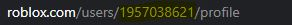

# Roblox-Inventory-Shopper

# How To Use
   - enter an ID, NOT a username. An ID is the group of numbers you see when going on a roblox link.
      - eg. 1957038621
      - 
   - wait for the results to load
   - <b>if this step takes longer than 2 minutes, there may be an error so you will have to either start again or contact me on github/roblox</b>

# Contact
   - roblox: https://www.roblox.com/users/1957038621/profile
   - github: https://github.com/scripped

# Support me
   - purchase my donation gamepasses: https://www.roblox.com/users/1957038621/profile

<h3>Super sorry that the file is so large, I've tried everything to make it smaller but nothing seems to work.</h3>

The 'Roblox Inventory Shopper V1' created by Scripped is a web scraper that displays information available to the public in a condensed form. This does not break any of ROBLOX's TOS.
